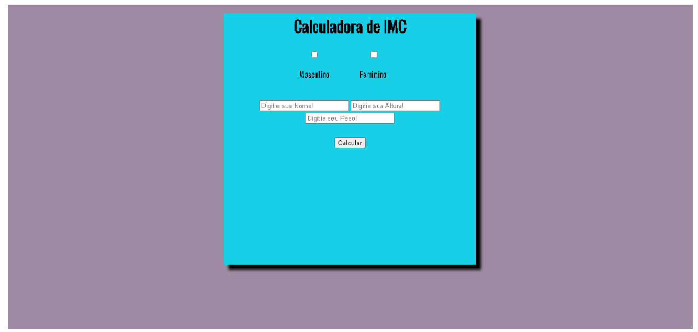

# Calculador de IMC
- Projeto desenvolvido com o objetivo de aplicar conhecimentos obtidos.Calculadora de IMC(Índice de Massa Corporal), utiliza a altura e peso para definir se o individuo está com o peso compatível com sua altura, com detalhes se estiver acima do peso, com o peso normal e abaixo.

